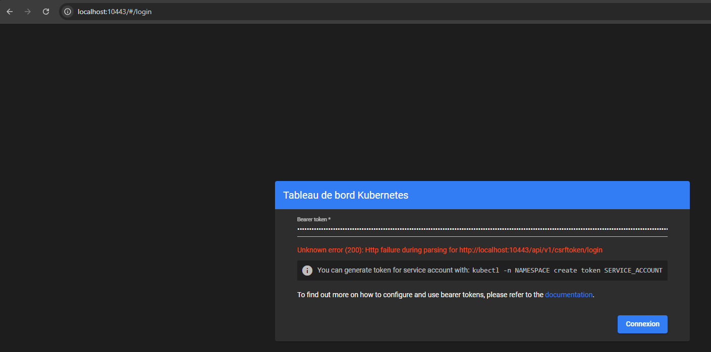

Домашнее задание к занятию «Kubernetes. Причины появления. Команда kubectl»

1. С использованием Minikube:
<p align="center">
  
  <br>
</p>
<p align="center">
  
  <br>
</p>
2. С использованием MicroK8S:
<p align="center">
  
  <br>
</p>
<p align="center">
  
  <br>
</p>
3. С использованием MicroK8S по инструкции, которое приложено как эталонное решение:
<p align="center">
  
  <br>
</p>

## Выполненные действия

### 1. Установка и настройка MicroK8S

```bash
sudo snap install microk8s --classic
sudo usermod -a -G microk8s $USER
sudo chown -f -R $USER ~/.kube
newgrp microk8s
microk8s enable dashboard
```

### 2. Настройка сертификатов для внешнего IP

Мой IP: `10.0.2.15`

```bash
sudo nano /var/snap/microk8s/current/certs/csr.conf.template
```

Добавлено: `IP.4 = 10.0.2.15`

```bash
sudo microk8s refresh-certs --cert front-proxy-client.crt
```

### 3. Создание пользователя и получение токена

```bash
cat <<EOF | microk8s kubectl apply -f -
apiVersion: v1
kind: ServiceAccount
metadata:
  name: admin-user
  namespace: kubernetes-dashboard
---
apiVersion: rbac.authorization.k8s.io/v1
kind: ClusterRoleBinding
metadata:
  name: admin-user
roleRef:
  apiGroup: rbac.authorization.k8s.io
  kind: ClusterRole
  name: cluster-admin
subjects:
- kind: ServiceAccount
  name: admin-user
  namespace: kubernetes-dashboard
EOF
```

```bash
microk8s kubectl -n kubernetes-dashboard create token admin-user
```

### 4. Попытки доступа к Dashboard

#### Способ 1: Port-forward через Kong (HTTPS)

```bash
microk8s kubectl port-forward -n kubernetes-dashboard service/kubernetes-dashboard-kong-proxy 10443:443 --address=0.0.0.0 &
curl -k https://localhost:10443 | head -20
```

**Результат:** Зависает, не отвечает.

#### Способ 2: Kubectl proxy (HTTP)

```bash
microk8s kubectl proxy --address=0.0.0.0 --port=10443 --accept-hosts='.*' &
```

Открываю в браузере:

```
http://localhost:10443/api/v1/namespaces/kubernetes-dashboard/services/http:kubernetes-dashboard-web:8000/proxy/
```

Страница входа открывается, но после ввода токена ошибка:

```
Unknown error (200): Http failure during parsing for http://localhost:10443/api/v1/namespaces/kubernetes-dashboard/services/http:kubernetes-dashboard-web:8000/proxy/api/v1/csrftoken/login
```

#### Способ 3: NodePort

```bash
microk8s kubectl patch svc kubernetes-dashboard-web -n kubernetes-dashboard -p '{"spec":{"type":"NodePort"}}'
microk8s kubectl get svc -n kubernetes-dashboard
```

Вывод:

```
kubernetes-dashboard-web    NodePort    10.152.183.196   <none>  8000:32018/TCP
```

Открываю `http://localhost:32018` → та же ошибка с CSRF-токеном.

```bash
[Ollrins@vbox ~]$ kubectl logs -n kubernetes-dashboard deployment/kubernetes-dashboard-kong --tail=50
Defaulted container "proxy" out of: proxy, clear-stale-pid (init)
nginx: [warn] the "user" directive makes sense only if the master process runs with super-user privileges, ignored in /kong_prefix/nginx.conf:7
2026/07/08 09:40:51 [notice] 1#0: [lua] init.lua:794: init(): [request-debug] token for request debugging: 17ae9f56-b0ae-4095-8576-5bee569a7946
2026/07/08 09:40:51 [notice] 1#0: using the "epoll" event method
2026/07/08 09:40:51 [notice] 1#0: openresty/1.25.3.2
2026/07/08 09:40:51 [notice] 1#0: OS: Linux 6.12.0-205.el10.x86_64
2026/07/08 09:40:51 [notice] 1#0: getrlimit(RLIMIT_NOFILE): 65536:65536
2026/07/08 09:40:51 [notice] 1#0: start worker processes
2026/07/08 09:40:51 [notice] 1#0: start worker process 1406
2026/07/08 09:40:51 [notice] 1406#0: *1 [lua] broker.lua:215: init(): event broker is ready to accept connections on worker #0, context: init_worker_by_lua*
2026/07/08 09:40:51 [notice] 1406#0: *1 [lua] init.lua:266: purge(): [DB cache] purging (local) cache, context: init_worker_by_lua*
2026/07/08 09:40:51 [notice] 1406#0: *1 [lua] init.lua:266: purge(): [DB cache] purging (local) cache, context: init_worker_by_lua*
2026/07/08 09:40:51 [notice] 1406#0: *1 [kong] init.lua:590 declarative config loaded from /kong_dbless/kong.yml, context: init_worker_by_lua*
2026/07/08 09:40:51 [notice] 1406#0: *3 [lua] worker.lua:304: communicate(): worker #0 is ready to accept events from unix:/kong_prefix/sockets/we, context: ngx.timer
2026/07/08 09:40:51 [notice] 1406#0: *644 [lua] broker.lua:263: run(): worker #0 connected to events broker (worker pid: 1406), client: unix:, server: kong_worker_events, request: "GET / HTTP/1.1", host: "localhost"
127.0.0.1 - - [08/Jul/2026:09:44:18 +0000] "GET / HTTP/1.1" 400 220 "-" "curl/8.12.1" kong_request_id: "7c40f77e5d17e84a52f93c070b5df322"
127.0.0.1 - - [08/Jul/2026:09:45:40 +0000] "GET / HTTP/2.0" 499 0 "-" "curl/8.12.1" kong_request_id: "0e461a3b78850f2a070234025bda7d58"
2026/07/08 09:46:03 [error] 1406#0: *716 upstream timed out (110: Connection timed out) while connecting to upstream, client: 127.0.0.1, server: kong, request: "GET / HTTP/2.0", upstream: "http://10.152.183.196:8000/", host: "localhost:10443", request_id: "92b7ea69578b94535e8e7939f465134d"
2026/07/08 09:46:41 [error] 1406#0: *731 upstream timed out (110: Connection timed out) while connecting to upstream, client: 127.0.0.1, server: kong, request: "GET / HTTP/2.0", upstream: "http://10.152.183.196:8000/", host: "localhost:10443", request_id: "c03a747670d3801f41d48126009d3454"
2026/07/08 09:47:03 [error] 1406#0: *716 upstream timed out (110: Connection timed out) while connecting to upstream, client: 127.0.0.1, server: kong, request: "GET / HTTP/2.0", upstream: "http://10.152.183.196:8000/", host: "localhost:10443", request_id: "92b7ea69578b94535e8e7939f465134d"
2026/07/08 09:47:41 [error] 1406#0: *731 upstream timed out (110: Connection timed out) while connecting to upstream, client: 127.0.0.1, server: kong, request: "GET / HTTP/2.0", upstream: "http://10.152.183.196:8000/", host: "localhost:10443", request_id: "c03a747670d3801f41d48126009d3454"
2026/07/08 09:48:03 [error] 1406#0: *716 upstream timed out (110: Connection timed out) while connecting to upstream, client: 127.0.0.1, server: kong, request: "GET / HTTP/2.0", upstream: "http://10.152.183.196:8000/", host: "localhost:10443", request_id: "92b7ea69578b94535e8e7939f465134d"
127.0.0.1 - - [08/Jul/2026:09:48:38 +0000] "GET / HTTP/2.0" 499 0 "-" "Mozilla/5.0 (X11; Linux x86_64; rv:140.0) Gecko/20100101 Firefox/140.0" kong_request_id: "b9d7ff6d6019146994207d497c68d45f"
127.0.0.1 - - [08/Jul/2026:09:48:39 +0000] "GET / HTTP/2.0" 499 0 "-" "Mozilla/5.0 (X11; Linux x86_64; rv:140.0) Gecko/20100101 Firefox/140.0" kong_request_id: "4ec80c191590575691d07448763f0057"
127.0.0.1 - - [08/Jul/2026:09:48:40 +0000] "GET / HTTP/2.0" 499 0 "-" "Mozilla/5.0 (X11; Linux x86_64; rv:140.0) Gecko/20100101 Firefox/140.0" kong_request_id: "9eba066713f9796f452f73040a70183a"
127.0.0.1 - - [08/Jul/2026:09:48:40 +0000] "GET / HTTP/2.0" 499 0 "-" "Mozilla/5.0 (X11; Linux x86_64; rv:140.0) Gecko/20100101 Firefox/140.0" kong_request_id: "27029b3f6dd6b60dc7a55534a342923e"
127.0.0.1 - - [08/Jul/2026:09:48:40 +0000] "GET / HTTP/2.0" 499 0 "-" "Mozilla/5.0 (X11; Linux x86_64; rv:140.0) Gecko/20100101 Firefox/140.0" kong_request_id: "caed9e58199f923baf9f85615ca58942"
127.0.0.1 - - [08/Jul/2026:09:48:40 +0000] "GET / HTTP/2.0" 499 0 "-" "Mozilla/5.0 (X11; Linux x86_64; rv:140.0) Gecko/20100101 Firefox/140.0" kong_request_id: "702a270f0d2eff1a500b9d0f7e70414a"
2026/07/08 09:48:41 [error] 1406#0: *731 upstream timed out (110: Connection timed out) while connecting to upstream, client: 127.0.0.1, server: kong, request: "GET / HTTP/2.0", upstream: "http://10.152.183.196:8000/", host: "localhost:10443", request_id: "c03a747670d3801f41d48126009d3454"
2026/07/08 09:49:03 [error] 1406#0: *716 upstream timed out (110: Connection timed out) while connecting to upstream, client: 127.0.0.1, server: kong, request: "GET / HTTP/2.0", upstream: "http://10.152.183.196:8000/", host: "localhost:10443", request_id: "92b7ea69578b94535e8e7939f465134d"
2026/07/08 09:49:40 [error] 1406#0: *785 upstream timed out (110: Connection timed out) while connecting to upstream, client: 127.0.0.1, server: kong, request: "GET / HTTP/2.0", upstream: "http://10.152.183.196:8000/", host: "localhost:10443", request_id: "85b30e45580dd111da4abf2245ee823b"
2026/07/08 09:49:41 [error] 1406#0: *731 upstream timed out (110: Connection timed out) while connecting to upstream, client: 127.0.0.1, server: kong, request: "GET / HTTP/2.0", upstream: "http://10.152.183.196:8000/", host: "localhost:10443", request_id: "c03a747670d3801f41d48126009d3454"
2026/07/08 09:50:03 [error] 1406#0: *716 upstream timed out (110: Connection timed out) while connecting to upstream, client: 127.0.0.1, server: kong, request: "GET / HTTP/2.0", upstream: "http://10.152.183.196:8000/", host: "localhost:10443", request_id: "92b7ea69578b94535e8e7939f465134d"
127.0.0.1 - - [08/Jul/2026:09:50:36 +0000] "GET / HTTP/2.0" 499 0 "-" "curl/8.12.1" kong_request_id: "c8e051311b1f4149458bb70f81b8511f"
2026/07/08 09:50:40 [error] 1406#0: *785 upstream timed out (110: Connection timed out) while connecting to upstream, client: 127.0.0.1, server: kong, request: "GET / HTTP/2.0", upstream: "http://10.152.183.196:8000/", host: "localhost:10443", request_id: "85b30e45580dd111da4abf2245ee823b"
2026/07/08 09:50:41 [error] 1406#0: *731 upstream timed out (110: Connection timed out) while connecting to upstream, client: 127.0.0.1, server: kong, request: "GET / HTTP/2.0", upstream: "http://10.152.183.196:8000/", host: "localhost:10443", request_id: "c03a747670d3801f41d48126009d3454"
127.0.0.1 - - [08/Jul/2026:09:50:58 +0000] "GET / HTTP/2.0" 499 0 "-" "curl/8.12.1" kong_request_id: "c03a747670d3801f41d48126009d3454"
2026/07/08 09:51:03 [error] 1406#0: *716 upstream timed out (110: Connection timed out) while connecting to upstream, client: 127.0.0.1, server: kong, request: "GET / HTTP/2.0", upstream: "http://10.152.183.196:8000/", host: "localhost:10443", request_id: "92b7ea69578b94535e8e7939f465134d"
127.0.0.1 - - [08/Jul/2026:09:51:03 +0000] "GET / HTTP/2.0" 504 242 "-" "Mozilla/5.0 (Windows NT 10.0; Win64; x64) AppleWebKit/537.36 (KHTML, like Gecko) Chrome/149.0.0.0 Safari/537.36" kong_request_id: "92b7ea69578b94535e8e7939f465134d"
2026/07/08 09:51:40 [error] 1406#0: *785 upstream timed out (110: Connection timed out) while connecting to upstream, client: 127.0.0.1, server: kong, request: "GET / HTTP/2.0", upstream: "http://10.152.183.196:8000/", host: "localhost:10443", request_id: "85b30e45580dd111da4abf2245ee823b"
127.0.0.1 - - [08/Jul/2026:09:51:50 +0000] "GET /favicon.ico HTTP/2.0" 499 0 "https://localhost:10443/" "Mozilla/5.0 (Windows NT 10.0; Win64; x64) AppleWebKit/537.36 (KHTML, like Gecko) Chrome/149.0.0.0 Safari/537.36" kong_request_id: "7b385532daab3459fd20267fc900624b"
2026/07/08 09:52:40 [error] 1406#0: *785 upstream timed out (110: Connection timed out) while connecting to upstream, client: 127.0.0.1, server: kong, request: "GET / HTTP/2.0", upstream: "http://10.152.183.196:8000/", host: "localhost:10443", request_id: "85b30e45580dd111da4abf2245ee823b"
2026/07/08 09:53:40 [error] 1406#0: *785 upstream timed out (110: Connection timed out) while connecting to upstream, client: 127.0.0.1, server: kong, request: "GET / HTTP/2.0", upstream: "http://10.152.183.196:8000/", host: "localhost:10443", request_id: "85b30e45580dd111da4abf2245ee823b"
2026/07/08 09:54:13 [error] 1406#0: *879 upstream timed out (110: Connection timed out) while connecting to upstream, client: 127.0.0.1, server: kong, request: "GET / HTTP/2.0", upstream: "http://10.152.183.196:8000/", host: "localhost:10443", request_id: "ef3b8c2f8ef19a47404062228df69216"
127.0.0.1 - - [08/Jul/2026:09:54:14 +0000] "GET / HTTP/2.0" 499 0 "-" "Mozilla/5.0 (X11; Linux x86_64; rv:140.0) Gecko/20100101 Firefox/140.0" kong_request_id: "85b30e45580dd111da4abf2245ee823b"
127.0.0.1 - - [08/Jul/2026:09:54:18 +0000] "GET / HTTP/2.0" 499 0 "-" "Mozilla/5.0 (X11; Linux x86_64; rv:140.0) Gecko/20100101 Firefox/140.0" kong_request_id: "a2ea1437856fd5269866ab50c9ecaf76"
2026/07/08 09:55:13 [error] 1406#0: *879 upstream timed out (110: Connection timed out) while connecting to upstream, client: 127.0.0.1, server: kong, request: "GET / HTTP/2.0", upstream: "http://10.152.183.196:8000/", host: "localhost:10443", request_id: "ef3b8c2f8ef19a47404062228df69216"
2026/07/08 09:55:30 [error] 1406#0: *898 upstream timed out (110: Connection timed out) while connecting to upstream, client: 127.0.0.1, server: kong, request: "GET / HTTP/2.0", upstream: "http://10.152.183.196:8000/", host: "localhost:10443", request_id: "f3458c345f0c01056c2f4235bd332b0d"
127.0.0.1 - - [08/Jul/2026:09:55:30 +0000] "GET / HTTP/1.1" 400 622 "-" "Mozilla/5.0 (Windows NT 10.0; Win64; x64) AppleWebKit/537.36 (KHTML, like Gecko) Chrome/149.0.0.0 Safari/537.36" kong_request_id: "78ab93401bcfc7161ad9b44fe9d5ba4f"
127.0.0.1 - - [08/Jul/2026:09:55:30 +0000] "GET / HTTP/1.1" 400 622 "-" "Mozilla/5.0 (Windows NT 10.0; Win64; x64) AppleWebKit/537.36 (KHTML, like Gecko) Chrome/149.0.0.0 Safari/537.36" kong_request_id: "28fdc6316ae4515f6746fc19adb0d576"
```
