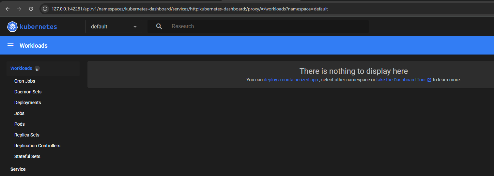
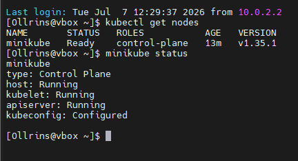
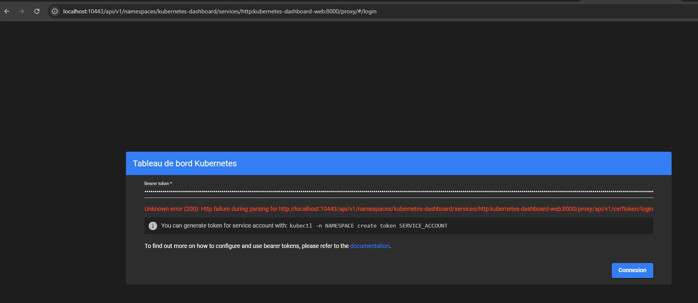
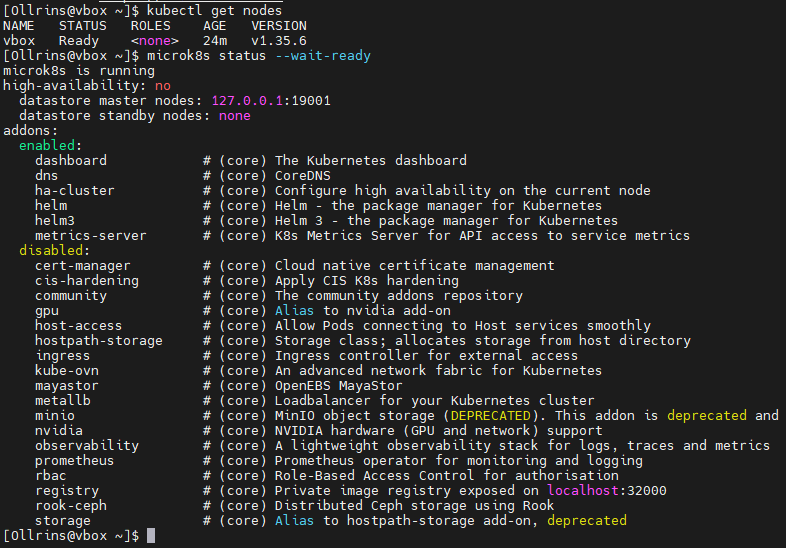

Домашнее задание к занятию «Kubernetes. Причины появления. Команда kubectl»

1. С использованием Minikube:
<p align="center">
  
  <br>
</p>
<p align="center">
  
  <br>
</p>
2. С использованием MicroK8S:
<p align="center">
  
  <br>
</p>
<p align="center">
  
  <br>
</p>

## Выполненные действия

### 1. Установка и настройка MicroK8S

```bash
sudo snap install microk8s --classic
sudo usermod -a -G microk8s $USER
sudo chown -f -R $USER ~/.kube
newgrp microk8s
microk8s enable dashboard
```

### 2. Настройка сертификатов для внешнего IP

Мой IP: `10.0.2.15`

```bash
sudo nano /var/snap/microk8s/current/certs/csr.conf.template
```

Добавлено: `IP.4 = 10.0.2.15`

```bash
sudo microk8s refresh-certs --cert front-proxy-client.crt
```

### 3. Создание пользователя и получение токена

```bash
cat <<EOF | microk8s kubectl apply -f -
apiVersion: v1
kind: ServiceAccount
metadata:
  name: admin-user
  namespace: kubernetes-dashboard
---
apiVersion: rbac.authorization.k8s.io/v1
kind: ClusterRoleBinding
metadata:
  name: admin-user
roleRef:
  apiGroup: rbac.authorization.k8s.io
  kind: ClusterRole
  name: cluster-admin
subjects:
- kind: ServiceAccount
  name: admin-user
  namespace: kubernetes-dashboard
EOF
```

```bash
microk8s kubectl -n kubernetes-dashboard create token admin-user
```

### 4. Попытки доступа к Dashboard

#### Способ 1: Port-forward через Kong (HTTPS)

```bash
microk8s kubectl port-forward -n kubernetes-dashboard service/kubernetes-dashboard-kong-proxy 10443:443 --address=0.0.0.0 &
curl -k https://localhost:10443 | head -20
```

**Результат:** Зависает, не отвечает.

#### Способ 2: Kubectl proxy (HTTP)

```bash
microk8s kubectl proxy --address=0.0.0.0 --port=10443 --accept-hosts='.*' &
```

Открываю в браузере:

```
http://localhost:10443/api/v1/namespaces/kubernetes-dashboard/services/http:kubernetes-dashboard-web:8000/proxy/
```

Страница входа открывается, но после ввода токена ошибка:

```
Unknown error (200): Http failure during parsing for http://localhost:10443/api/v1/namespaces/kubernetes-dashboard/services/http:kubernetes-dashboard-web:8000/proxy/api/v1/csrftoken/login
```

#### Способ 3: NodePort

```bash
microk8s kubectl patch svc kubernetes-dashboard-web -n kubernetes-dashboard -p '{"spec":{"type":"NodePort"}}'
microk8s kubectl get svc -n kubernetes-dashboard
```

Вывод:

```
kubernetes-dashboard-web    NodePort    10.152.183.196   <none>  8000:32018/TCP
```

Открываю `http://localhost:32018` → та же ошибка с CSRF-токеном.
